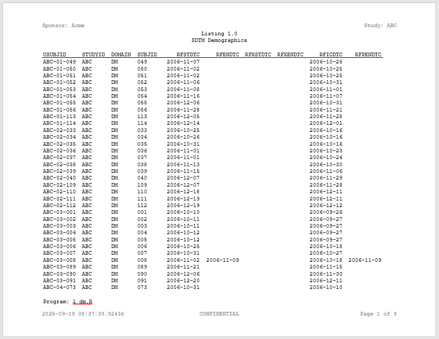

```{r setup, include = FALSE}
knitr::opts_chunk$set(
  collapse = TRUE,
  comment = "#>"
)
```
In this example, we will generate code for a listing using the **macro** package.
Generating the code makes it more readable and more compact.  

Note that this example 
has been intentionally simplified to make it easier to understand how the macro
language works.

## Generate a Listing

To generate the listing, we will need two files:

  * A macro driver script 
  * A template listing program  
  
### Macro Driver Script

Here is the macro driver script:
```{r eval=FALSE, echo=TRUE}
#%%%%%%%%%%%%%%%%%%%%%%%%%%%%%%%%%%%#
#% Define Macro Variables
#%%%%%%%%%%%%%%%%%%%%%%%%%%%%%%%%%%%#
#%let sponsor_name <- Acme
#%let study_name <- ABC
#%let prog_name <- l_dm
#%let base_dir <- c:/packages/Testing/macro/code
#%let output_dir <- base_dir./output
#%let data_dir <- base_dir./data
#%let data_file <- dm.rda
#%let data_name <- dm
#%let titles <- c("Listing 1.0", "SDTM Demographics")
#%let footnotes <- c("Program: prog_name..R")

#%%%%%%%%%%%%%%%%%%%%%%%%%%%%%%%%%%%#
#% Pull in listing template code
#%%%%%%%%%%%%%%%%%%%%%%%%%%%%%%%%%%%#
#%include 'base_dir./templates/lst01.R'

```
As you can see, the macro driver is very simple.  All it does is assign the 
necessary macro variables, and include the listing template.  

### Template Listing Program

Here is the template listing program:

```{r eval=FALSE, echo=TRUE}
#####################################################################
# Program Name: prog_name.
# Study: study_name.
#####################################################################

library(reporter)

# Output path
out_pth <- "output_dir./prog_name."

# Get listing data
load("data_dir./data_file.")

# Create table object
tbl <- create_table(data_name.) |> 
  define(USUBJID, id_var = TRUE)

# Create report object
rpt <- create_report(out_pth, font = "Courier", output_type = "RTF") |> 
  page_header("Sponsor: sponsor_name.", "Study: study_name.") |> 
  titles(titles.) |> 
  add_content(tbl, align = "left") |> 
  footnotes(footnotes.) |> 
  page_footer(Sys.time(), "CONFIDENTIAL", "Page [pg] of [tpg]")

# Write report to file
write_report(rpt)

```
Notice in the above code that there are several macro variables.  They end
with a dot (".").  These macro variables will be replaced with real values
when the macro driver runs.

Also notice that the macro variables can be located anywhere in the program:
in comments, in text strings, or in open code. The resolution routine will
examine the entire program from top to bottom, replacing values as it goes.

## How To Run 

To run the macro, we will simply call `msource()` from the command line. 
We will pass the name of the program to run and the 
generated code file to output. Like this:
```{r eval=FALSE, echo=TRUE}
msource("./macro/Example1.R", "./macro/code/l_dm.R")
```

### Generated Code

Upon execution, the generated code file will look like this:
```{r eval=FALSE, echo=TRUE}
#####################################################################
# Program Name: l_dm
# Study: ABC
#####################################################################

library(reporter)

# Output path
out_pth <- "c:/packages/Testing/macro/code/output/l_dm"

# Get listing data
load("c:/packages/Testing/macro/code/data/dm.rda")

# Create table object
tbl <- create_table(dm) |> 
  define(USUBJID, id_var = TRUE)

# Create report object
rpt <- create_report(out_pth, font = "Courier", output_type = "RTF") |> 
  page_header("Sponsor: Acme", "Study: ABC") |> 
  titles(c("Listing 1.0", "SDTM Demographics")) |> 
  add_content(tbl, align = "left") |> 
  footnotes(c("Program: l_dm.R")) |> 
  page_footer(Sys.time(), "CONFIDENTIAL", "Page [pg] of [tpg]")

# Write report to file
write_report(rpt)
  
```
Notice that all macro variables have been resolved, and the code is easily
readable. The code actually looks like a human wrote it. Readability is a 
major advantage of generating code instead of 
writing a generalized program. 

This technique gives you the best of all worlds: It is easy to build and 
maintain, allows a high degree of code reuse, provides flexible parameterization,
and yet still produces simple, readable programs.  These readable
programs will be greatly appreciated by anyone who reviews your work.

### Output Report

Here is the output report:


To create a listing for a different dataset, all you need is a new macro 
driver, with different parameters.  The template code will be the same.

Next: [Example 2: Another Listing](macro-example2.html)
