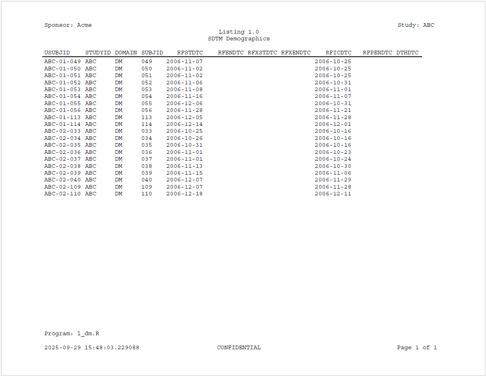

```{r setup, include = FALSE}
knitr::opts_chunk$set(
  collapse = TRUE,
  comment = "#>"
)
```
In this example, we will create the same listing, but in a slightly different 
way. This time we'll add some more complexity.

## Generate a Listing

To generate the listing, we will still need just two files:

  * A macro driver script 
  * A template listing program  
  
### Macro Driver Script

Here is the macro driver script. What is different is that the macro driver 
is written in standard R code, and uses the `symput()` and `symget()` symbol
table functions to set the macro variable values:
```{r eval=FALSE, echo=TRUE}
library(macro)

#***********************************#
#* Define Macro Variables
#***********************************#
`&sponsor_name` <- "Acme"
`&study_name` <- "ABC"
`&prog_name` <- "l_dm"
`&base_dir` <- "c:/packages/macro/tests/testthat/examples"
`&output_dir` <- "&base_dir/output"
`&data_dir` <- "&base_dir/data"
`&data_file` <- "dm.rda"
`&data_name` <- "dm"
`&titles` <- c("Listing 1.0", "SDTM Demographics")
`&footnotes` <- "'Program: &prog_name..R'"
`&output_type` <- "PDF"
`&preview` <- TRUE

#***********************************#
#* Macro Source Listing Template Code
#***********************************#
msource(file.path(`&base_dir`, "templates/lst02.R"),
        file.path(`&base_dir`, "code/l_dm2.R"),
        debug = TRUE)

```
Note the following in the above driver:

  * Macro variables can be set in regular R code before `msource()` is called. 
  The variable names must have a leading ampersand.  These variables will be 
  copied to the macro symbol table when `msource()` starts.
  * All text variable values are quoted to conform to standard R syntax.
  * The macro variables are still regular R variables, and you can use them 
  in other functions like `paste()` or `file.path()`.
  * The above approach allows you to execute `msource()` directly
  from the driver script.  This approach avoids having to run it on the command
  line or Addin menu. Instead, you can run it from the "Source" or "Run" 
  button in your development environment.
  * The above call to `msource()` includes the `debug = TRUE` parameter. This 
  option will generate debug information in the console.  The debug information 
  will be shown below.
  

Otherwise, the macro driver performs the exact same tasks as the previous
listing example.  It sets the macro variable values and executes the template
program.

### Template Listing Program

Here is the template program for the second listing.  This template listing has 
a few more macro statements than the previous one:

```{r eval=FALSE, echo=TRUE}
#####################################################################
# Program Name: &prog_name.
# Study: &study_name.
#####################################################################

library(reporter)

# Output path
out_pth <- "&output_dir./&prog_name."

# Get listing data
load("&data_dir./&data_file.")

# Create table object
tbl <- create_table(`&data_name.`) |>
  define(USUBJID, id_var = TRUE)

#% Assign default output type
#%if (%symexist(output_type) == FALSE)
#%let output_type <- RTF
#%end

# Create report object
rpt <- create_report(out_pth, font = "Courier", output_type = "&output_type.") |>
  page_header("Sponsor: &sponsor_name.", "Study: &study_name.") |>
  titles(`&titles.`) |>
  add_content(tbl, align = "left") |>
  footnotes(`&footnotes.`) |>
  page_footer(Sys.time(), "CONFIDENTIAL", "Page [pg] of [tpg]")

# Write report to file
#%if (&preview. == TRUE)
write_report(rpt, preview = 1)
#%else
write_report(rpt)
#%end

```
One piece of logic added to this template is to 
set the `output_type.` macro variable to "RTF" if it does not exist.  This 
example demonstrates the use of the `%symexist()` function.

Another piece of macro logic added is to optionally preview the report. 
If `preview.` is set to TRUE, the macro will
append a parameter to `write_report()` to only print the first page of the 
report.  This option can reduce the amount of time the program runs 
while you are developing.

## How To Run 

Since the call to `msource()` is included directly in the macro driver script,
you can source the script normally in RStudio or another editor.  When executed,
the script will write the following to the console:
```
> source("C:/packages/macro/tests/testthat/examples/Example2.R")
******************************************************************************** 
**  Pre-Processing 
******************************************************************************** 
-    File In: c:/packages/macro/tests/testthat/examples/templates/lst02.R 
-   File Out: c:/packages/macro/tests/testthat/examples/code/l_dm2.R 
******************************************************************************** 
[ In#][Out#]: 
[   1][   1]: ##################################################################### 
[   2][   2]: # Program Name: l_dm 
[   3][   3]: # Study: ABC 
[   4][   4]: ##################################################################### 
[   5][   5]:  
[   6][   6]: library(reporter) 
[   7][   7]:  
[   8][   8]: # Output path 
[   9][   9]: out_pth <- "c:/packages/macro/tests/testthat/examples/output/l_dm" 
[  10][  10]:  
[  11][  11]: # Get listing data 
[  12][  12]: load("c:/packages/macro/tests/testthat/examples/data/dm.rda") 
[  13][  13]:  
[  14][  14]: # Create table object 
[  15][  15]: tbl <- create_table(dm) |> 
[  16][  16]:   define(USUBJID, id_var = TRUE) 
[  17][  17]:  
[  18][    ]: #% Assign default output type 
[  19][    ]: #%if (TRUE == FALSE) 
[  20][    ]: #%let output_type <- RTF 
[  21][    ]: #%end 
[  22][    ]:  
[  23][  18]: # Create report object 
[  24][  19]: rpt <- create_report(out_pth, font = "Courier", output_type = "PDF") |> 
[  25][  20]:   page_header("Sponsor: Acme", "Study: ABC") |> 
[  26][  21]:   titles(c('Listing 1.0', 'SDTM Demographics')) |> 
[  27][  22]:   add_content(tbl, align = "left") |> 
[  28][  23]:   footnotes('Program: l_dm.R') |> 
[  29][  24]:   page_footer(Sys.time(), "CONFIDENTIAL", "Page [pg] of [tpg]") 
[  30][  25]:  
[  31][  26]: # Write report to file 
[  32][    ]: #%if (&preview. == TRUE) 
[  33][  27]: write_report(rpt, preview = 1) 
[  34][    ]: #%else 
[  35][    ]: write_report(rpt) 
[  36][    ]: #%end 
******************************************************************************** 
**  Execution 
******************************************************************************** 

> #####################################################################
> # Program Name: l_dm
> # Study: ABC
> ###################################### .... [TRUNCATED] 

> # Output path
> out_pth <- "c:/packages/macro/tests/testthat/examples/output/l_dm"

> # Get listing data
> load("c:/packages/macro/tests/testthat/examples/data/dm.rda")

> # Create table object
> tbl <- create_table(dm) |>
+   define(USUBJID, id_var = TRUE)

> # Create report object
> rpt <- create_report(out_pth, font = "Courier", output_type = "PDF") |>
+   page_header("Sponsor: Acme", "Study: ABC") |>
+ .... [TRUNCATED] 

> # Write report to file
> write_report(rpt, preview = 1)
# A report specification: 1 pages  PREVIEW
- file_path: 'c:/packages/macro/tests/testthat/examples/output/l_dm.pdf'
- output_type: PDF
- units: inches
- orientation: landscape
- margins: top 0.5 bottom 0.5 left 1 right 1
- line size/count: 9/47
- page_header: left=Sponsor: Acme right=Study: ABC
- title 1: 'Listing 1.0'
- title 2: 'SDTM Demographics'
- footnote 1: 'Program: l_dm.R'
- page_footer: left=2025-11-16 00:17:40.081514 center=CONFIDENTIAL right=Page [pg] of [tpg]
- content: 
# A table specification:
- data: tibble 'dm' 87 rows 24 cols
- show_cols: all
- use_attributes: all
- define: USUBJID id_var='TRUE' 
 
******************************************************************************** 
**  End 
******************************************************************************** 
```
The debug information contains a pre-processor section and a section for 
execution of the generated code.  These two sections can help you isolate
problems with your program. 

For more information on debugging, see the [debugging vignette](macro-debug.html).

### Generated Code

Upon execution, the generated code file will look like this:
```{r eval=FALSE, echo=TRUE}
#####################################################################
# Program Name: l_dm
# Study: ABC
#####################################################################

library(reporter)

# Output path
out_pth <- "c:/packages/macro/tests/testthat/examples/output/l_dm"

# Get listing data
load("c:/packages/macro/tests/testthat/examples/data/dm.rda")

# Create table object
tbl <- create_table(dm) |>
  define(USUBJID, id_var = TRUE)

# Create report object
rpt <- create_report(out_pth, font = "Courier", output_type = "PDF") |>
  page_header("Sponsor: Acme", "Study: ABC") |>
  titles(c('Listing 1.0', 'SDTM Demographics')) |>
  add_content(tbl, align = "left") |>
  footnotes('Program: l_dm.R') |>
  page_footer(Sys.time(), "CONFIDENTIAL", "Page [pg] of [tpg]")

# Write report to file
write_report(rpt, preview = 1)
```
The listing code above is identical to the previous listing, except
the output type is "PDF" and the `preview` parameter is set on the call
to `write_report()`.

### Output Report

Here is the output report for the modified listing:




Next: [Example 3: Table](macro-example3.html)
