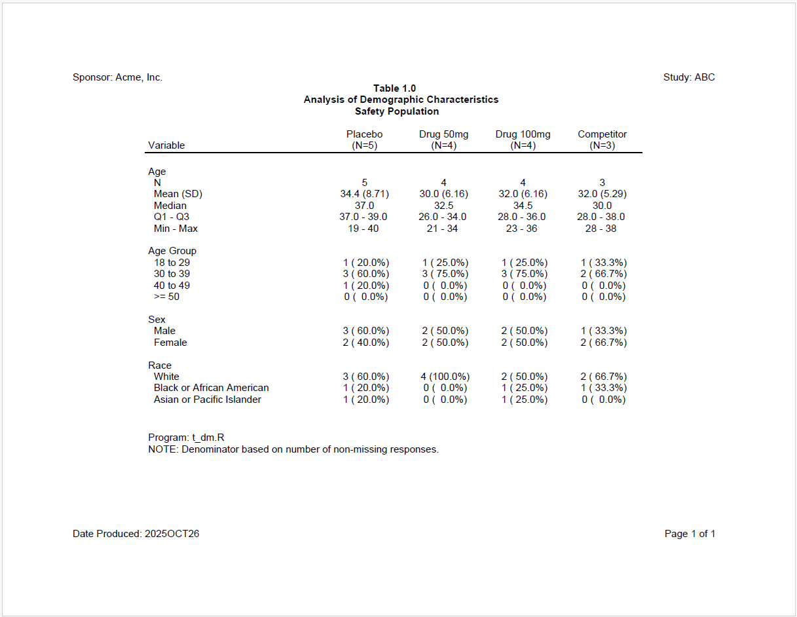

```{r setup, include = FALSE}
knitr::opts_chunk$set(
  collapse = TRUE,
  comment = "#>"
)
```

Now let's look at a still more complicated example. For this example,
we want to create a demographics table that can be used across multiple studies.
Therefore, we'll need to let the user pass in parameters like treatment
groups, the path to the data, and which variables to include in the analysis.
The **macro** package makes it easy to create such a parameterized table.

## Generate a Demographics Table

To generate the table, we will need four files:

  * A macro driver script 
  * A template table program
  * A sample data code snippet
  * A report code snippet

### Macro Driver Script

In the second listing example, we assigned macro parameters directly in R code.  
That technique will be used again here:  

```{r eval=FALSE, echo=TRUE}

#####################################
# Assign Macro Variables
#####################################

# Assign base path
`&base_path` <- "c:/packages/macro/tests/testthat/examples"

# Assign relative paths
`&log_path` <- file.path(`&base_path`, "log")
`&output_path` <- file.path(`&base_path`, "output")
`&template_path` <- file.path(`&base_path`, "templates")
`&data_path` <- file.path(`&base_path`, "data")

# Assign global variables
`&sponsor_name` <- "Acme, Inc."
`&study_name` <- "ABC"
`&prog_name` <- "t_dm"

# Select analysis variables
`&vars` <- c("AGE", "AGEG", "SEX", "RACE")
`&anals` <- c("cont", "cat", "cat", "cat")
`&lbls` <- c("Age", "Age Group", "Sex", "Race")

# Assign or get titles
`&titles` <- c("Table 1.0",
             "Analysis of Demographic Characteristics",
             "Safety Population")

# Assign or get footnotes
`&footnotes` <- c(paste0("Program: ", `&prog_name`, ".R"),
                "NOTE: Denominator based on number of non-missing responses.")

# Assign treatment groups and labels
`&trt_grps` <- c("ARM A" = "Placebo", "ARM B" = "Drug 50mg", "ARM C" = "Drug 100mg",
               "ARM D" = "Competitor")

# Assign other parameters
`&env` <- "dev" # "prod"
`&out_type` <- "PDF"

# Assign preview
`&preview` <- ", preview = 1"

# Preprocess and Run Example3
macro::msource(paste0(`&base_path`, "/templates/dm01.R"),
               paste0(`&base_path`, "/code/t_dm.R"))
```
Observe that there are four possible analysis variables for this demographics
table: "age", "ageg", "sex", and "race".  The program allows the user
to pick which variables will be added to the final report.  The template table
program will only output code for the selected analysis variables.

### Template Table Program

Here is the macro-enabled template program that the above driver is calling:

```{r eval=FALSE, echo=TRUE}
#####################################################################
# Program Name: &prog_name.
# Study: &study_name.
#####################################################################

library(sassy)

# Prepare Log -------------------------------------------------------------


options("logr.autolog" = TRUE,
        "logr.on" = TRUE,
        "logr.notes" = FALSE,
        "procs.print" = FALSE)

# Assign program name
prog_nm <- "&prog_name."

# Construct paths
l_path <- file.path("&log_path.", paste0(prog_nm, ".log"))
o_path <- file.path("&output_path.", prog_nm)

# Open log
lf <- log_open(l_path)

# Prepare formats ---------------------------------------------------------

sep("Prepare formats")

put("Compile format catalog")
fc <- fcat(MEAN = "%.1f", STD = "(%.2f)",
           Q1 = "%.1f", Q3 = "%.1f",
           MIN = "%d", MAX = "%d",
           CNT = "%2d", PCT = "(%5.1f%%)")


#%if ("AGEG" %in% &vars.)

put("Age Groups")
fc$AGEG <- value(condition(x >= 18 & x <= 29, "18 to 29"),
                 condition(x >=30 & x <= 39, "30 to 39"),
                 condition(x >=40 & x <=49, "40 to 49"),
                 condition(x >= 50, ">= 50"),
                 as.factor = TRUE)
#%end

#%if ("SEX" %in% &vars.)

put("Sex decodes")
fc$SEX <- value(condition(x == "M", "Male"),
                condition(x == "F", "Female"),
                condition(TRUE, "Other"),
                as.factor = TRUE)

#%end

#%if ("RACE" %in% &vars.)

put("Race decodes")
fc$RACE <- value(condition(x == "WHITE", "White"),
                 condition(x == "BLACK OR AFRICAN AMERICAN", "Black or African American"),
                 condition(x == "ASIAN", "Asian or Pacific Islander"),
                 condition(x == "UNKNOWN", "Unknown"),
                 condition(TRUE, "Other"),
                 as.factor = TRUE)

#%end


# Load and Prepare Data ---------------------------------------------------

sep("Prepare Data")

#%if ("&env." == "prod")

put("Get data")
libname(dat, "&data_path.", "Rda")

dm <- dat$dm

#%else

put("Create sample data.")
#%include '&template_path./dat01.R'

#%end

put("Log starting dataset")
put(dm)

put("Filter out screen failure")
dm_f <- subset(dm, ARM != 'SCREEN FAILURE')


put("Get ARM population counts")
proc_freq(dm_f, tables = ARM,
          output = long,
          options = v(nopercent, nonobs)) -> arm_pop

put("Log treatment groups variable")
trt_grps <- `&trt_grps`
put(trt_grps)

#%if ("AGEG" %in% &vars.)

put("Categorize AGE")
dm_f$AGEG <- fapply(dm_f$AGE, fc$AGEG)
#%end

#% Get length of variable vector
#%let varcnt <- %sysfunc(length(&vars.))
#%
# Perform Analysis  -------------------------------------------------------
#%
#% Iterate analysis variables
#%do idx = 1 %to &varcnt.
#%
#%let var <- %sysfunc(&vars[&idx])
#%let lvar <- %sysfunc(tolower("&var"))
#%let lbl <- %sysfunc(&lbls[&idx])
#%let anal <- %sysfunc(&anals[&idx])
#%
#%if ("&anal" == "cont")
#%
# &lbl. Summary Block -------------------------------------------------------

sep("Create summary statistics for &lvar..")

put("Call means procedure to get summary statistics for &lvar.")
proc_means(dm_f, var = `&var.`,
           stats = v(n, mean, std, median, q1, q3, min, max),
           by = ARM,
           options = v(notype, nofreq)) -> `&lvar._stats`

put("Combine stats")
datastep(`&lvar._stats`,
         format = fc,
         drop = find.names(`&lvar._stats`, start = 4),
         {
           VAR <- "lbl."
           `Mean (SD)` <- fapply2(MEAN, STD)
           Median <- MEDIAN
           `Q1 - Q3` <- fapply2(Q1, Q3, sep = " - ")
           `Min - Max` <- fapply2(MIN, MAX, sep = " - ")


         }) -> `&lvar._comb`

put("Transpose ARMs into columns")
proc_transpose(`&lvar._comb`,
               var = names(`&lvar._comb`),
               copy = VAR, id = BY,
               name = LABEL) -> `&lvar._block`
#%end
#%if ("&anal." == "cat")

# &lbl. Block ---------------------------------------------------------------

sep("Create frequency counts for &lbl.")

put("Get &lvar. frequency counts")
proc_freq(dm_f,
          table = `&var.`,
          by = ARM,
          options = nonobs) -> `&lvar._freq`

put("Combine counts and percents and assign age group factor for sorting")
datastep(`&lvar._freq`,
         format = fc,
         keep = v(VAR, LABEL, BY, CNTPCT),
         {
           VAR <- "&lbl."
           CNTPCT <- fapply2(CNT, PCT)
           #%if ("&var." == "AGEG")
           LABEL <- CAT
           #%else
           LABEL <- fapply(CAT, fc$`&var.`)
           #%end
         }) -> `&lvar._comb`


put("Sort by lvar. factor")
proc_sort(`&lvar._comb`, by = v(BY, LABEL)) -> `&lvar._sort`

put("Tranpose lvar. block")
proc_transpose(`&lvar._sort`,
               var = CNTPCT,
               copy = VAR,
               id = BY,
               by = LABEL,
               options = noname) -> `&lvar._block`
#%end
#%end

# Create final data frame -------------------------------------------------


#%let blocks <- %sysfunc(paste0(tolower(&vars.), "_block", collapse = ", "))

final <- rbind(`&blocks.`)

# Report ------------------------------------------------------------------

#% Include standard report code 01
#%include '&template_path./rpt01.R'

# Clean Up ----------------------------------------------------------------
sep("Clean Up")

put("Close log")
log_close()


# Uncomment to view report
# file.show(res$modified_path)

# Uncomment to view log
# file.show(lf)

```
In the above code, notice the following:

  * The template program includes logging from the **logr** package and formatting
  from the **fmtr** package.
  * Several macro variables are used from the macro driver. These macro variables
  include the program name, treatment groups, sponsor name, study name, etc.
  * Data for the program can either come from the "prod" or "dev" environment.
  If the environment is "dev", sample data is used.  If the environment is 
  "prod", a real dataset is used. The "dev" sample data comes from an 
  included code snippet.
    * Analysis variable blocks are created using functions from the **procs**
  package.
  * The code for all analysis variables is divided in the continuous and 
  categorical sections.  The appropriate analysis is driven by the "anals."
  macro variable. This template program can be easily extended to other analysis 
  variables.
  * The report code comes from an included template code snippet.  
  

### Template Code Snippets

Here is the template code for the sample dataset:

```{r eval=FALSE, echo=TRUE}
dm <- read.table(header = TRUE, text = '
       SUBJID  ARM    SEX  RACE    AGE
       "001"   "ARM A" "F"  "ASIAN" 19
       "002"   "ARM B" "F"  "WHITE" 21
       "003"   "ARM C" "F"  "WHITE" 23
       "004"   "ARM D" "F"  "BLACK OR AFRICAN AMERICAN" 28
       "005"   "ARM A" "M"  "WHITE" 37
       "006"   "ARM B" "M"  "WHITE" 34
       "007"   "ARM C" "M"  "ASIAN" 36
       "008"   "ARM D" "M"  "WHITE" 30
       "009"   "ARM A" "F"  "WHITE" 39
       "010"   "ARM B" "F"  "WHITE" 31
       "011"   "ARM C" "F"  "BLACK OR AFRICAN AMERICAN" 33
       "012"   "ARM D" "F"  "WHITE" 38
       "013"   "ARM A" "M"  "BLACK OR AFRICAN AMERICAN" 37
       "014"   "ARM B" "M"  "WHITE" 34
       "015"   "ARM C" "M"  "WHITE" 36
       "016"   "ARM A" "M"  "WHITE" 40')

```

Here is the template code for the report snippet:

```{r eval=FALSE, echo=TRUE}


sep("Create and print report")

#%if (%symexist(out_type) == FALSE)
#%let out_type <- "RTF"
#%end

# Get min and max columns
mincol <- names(trt_grps[1])
maxcol <- names(trt_grps[length(trt_grps)])

# Create Table
tbl <- create_table(final, first_row_blank = TRUE) |>
  column_defaults(from = mincol, to = maxcol, align = "center",
                  width = 1.1, standard_eval = TRUE) |>
  stub(vars = c("VAR", "LABEL"), "Variable", width = 2.5) |>
  define(VAR, blank_after = TRUE, dedupe = TRUE, label = "Variable",
         label_row = TRUE) |>
  define(LABEL, indent = .25, label = "Demographic Category") |>
  titles(`&titles.`, bold = TRUE) |>
  footnotes(`&footnotes.`)

# Add treatment groups
for (trt in names(trt_grps)) {
  tbl <- define(tbl, trt, label = trt_grps[trt], n = arm_pop[trt], standard_eval = TRUE)
}

# Create report
rpt <- create_report(o_path,
                     output_type = "&out_type.",
                     font = "Arial") |>
  page_header("Sponsor: &sponsor_name.", "Study: &study_name.") |>
  set_margins(top = 1, bottom = 1) |>
  add_content(tbl) |>
  page_footer("Date Produced: {toupper(fapply(Sys.Date(), '%Y%b%d'))}",
              right = "Page [pg] of [tpg]")

put("Write out the report")
res <- write_report(rpt&preview.)


```
In the above reporting code, notice the following:

  * The code starts by setting a default output type of "RTF" if the 
  `out_type` variable does not exist.  The condition uses the `%symexist()`
  function to make that determination.
  * Definitions for the treatment group columns are created dynamically
  from the `trt_grps` variable.
  * Titles, footnotes, etc. are populated from the macro driver.
  * The report functions come from the **reporter** package.

### Generated Code

Upon execution of the call to `msource()`, the following code will be generated:

```{r eval=FALSE, echo=TRUE}
#####################################################################
# Program Name: t_dm
# Study: ABC
#####################################################################

library(sassy)

# Prepare Log -------------------------------------------------------------


options("logr.autolog" = TRUE,
        "logr.on" = TRUE,
        "logr.notes" = FALSE,
        "procs.print" = FALSE)

# Assign program name
prog_nm <- "t_dm"

# Construct paths
l_path <- file.path("c:/packages/macro/tests/testthat/examples/log", paste0(prog_nm, ".log"))
o_path <- file.path("c:/packages/macro/tests/testthat/examples/output", prog_nm)

# Open log
lf <- log_open(l_path)

# Prepare formats ---------------------------------------------------------

sep("Prepare formats")

put("Compile format catalog")
fc <- fcat(MEAN = "%.1f", STD = "(%.2f)",
           Q1 = "%.1f", Q3 = "%.1f",
           MIN = "%d", MAX = "%d",
           CNT = "%2d", PCT = "(%5.1f%%)")


put("Age Groups")
fc$AGEG <- value(condition(x >= 18 & x <= 29, "18 to 29"),
                 condition(x >=30 & x <= 39, "30 to 39"),
                 condition(x >=40 & x <=49, "40 to 49"),
                 condition(x >= 50, ">= 50"),
                 as.factor = TRUE)


put("Sex decodes")
fc$SEX <- value(condition(x == "M", "Male"),
                condition(x == "F", "Female"),
                condition(TRUE, "Other"),
                as.factor = TRUE)


put("Race decodes")
fc$RACE <- value(condition(x == "WHITE", "White"),
                 condition(x == "BLACK OR AFRICAN AMERICAN", "Black or African American"),
                 condition(x == "ASIAN", "Asian or Pacific Islander"),
                 condition(x == "UNKNOWN", "Unknown"),
                 condition(TRUE, "Other"),
                 as.factor = TRUE)


# Load and Prepare Data ---------------------------------------------------

sep("Prepare Data")


put("Create sample data.")
dm <- read.table(header = TRUE, text = '
       SUBJID  ARM    SEX  RACE    AGE
       "001"   "ARM A" "F"  "ASIAN" 19
       "002"   "ARM B" "F"  "WHITE" 21
       "003"   "ARM C" "F"  "WHITE" 23
       "004"   "ARM D" "F"  "BLACK OR AFRICAN AMERICAN" 28
       "005"   "ARM A" "M"  "WHITE" 37
       "006"   "ARM B" "M"  "WHITE" 34
       "007"   "ARM C" "M"  "ASIAN" 36
       "008"   "ARM D" "M"  "WHITE" 30
       "009"   "ARM A" "F"  "WHITE" 39
       "010"   "ARM B" "F"  "WHITE" 31
       "011"   "ARM C" "F"  "BLACK OR AFRICAN AMERICAN" 33
       "012"   "ARM D" "F"  "WHITE" 38
       "013"   "ARM A" "M"  "BLACK OR AFRICAN AMERICAN" 37
       "014"   "ARM B" "M"  "WHITE" 34
       "015"   "ARM C" "M"  "WHITE" 36
       "016"   "ARM A" "M"  "WHITE" 40')


put("Log starting dataset")
put(dm)

put("Filter out screen failure")
dm_f <- subset(dm, ARM != 'SCREEN FAILURE')


put("Get ARM population counts")
proc_freq(dm_f, tables = ARM,
          output = long,
          options = v(nopercent, nonobs)) -> arm_pop

put("Log treatment groups variable")
trt_grps <- c('ARM A' = 'Placebo', 'ARM B' = 'Drug 50mg', 'ARM C' = 'Drug 100mg', 'ARM D' = 'Competitor')
put(trt_grps)


put("Categorize AGE")
dm_f$AGEG <- fapply(dm_f$AGE, fc$AGEG)

# Perform Analysis  -------------------------------------------------------
# Age Summary Block -------------------------------------------------------

sep("Create summary statistics for age.")

put("Call means procedure to get summary statistics for age")
proc_means(dm_f, var = AGE,
           stats = v(n, mean, std, median, q1, q3, min, max),
           by = ARM,
           options = v(notype, nofreq)) -> `age_stats`

put("Combine stats")
datastep(`age_stats`,
         format = fc,
         drop = find.names(`age_stats`, start = 4),
         {
           VAR <- "lbl."
           `Mean (SD)` <- fapply2(MEAN, STD)
           Median <- MEDIAN
           `Q1 - Q3` <- fapply2(Q1, Q3, sep = " - ")
           `Min - Max` <- fapply2(MIN, MAX, sep = " - ")


         }) -> `age_comb`

put("Transpose ARMs into columns")
proc_transpose(`age_comb`,
               var = names(`age_comb`),
               copy = VAR, id = BY,
               name = LABEL) -> `age_block`

# Age Group Block ---------------------------------------------------------------

sep("Create frequency counts for Age Group")

put("Get ageg frequency counts")
proc_freq(dm_f,
          table = AGEG,
          by = ARM,
          options = nonobs) -> `ageg_freq`

put("Combine counts and percents and assign age group factor for sorting")
datastep(`ageg_freq`,
         format = fc,
         keep = v(VAR, LABEL, BY, CNTPCT),
         {
           VAR <- "Age Group"
           CNTPCT <- fapply2(CNT, PCT)
           LABEL <- CAT
         }) -> `ageg_comb`


put("Sort by lvar. factor")
proc_sort(`ageg_comb`, by = v(BY, LABEL)) -> `ageg_sort`

put("Tranpose lvar. block")
proc_transpose(`ageg_sort`,
               var = CNTPCT,
               copy = VAR,
               id = BY,
               by = LABEL,
               options = noname) -> `ageg_block`

# Sex Block ---------------------------------------------------------------

sep("Create frequency counts for Sex")

put("Get sex frequency counts")
proc_freq(dm_f,
          table = SEX,
          by = ARM,
          options = nonobs) -> `sex_freq`

put("Combine counts and percents and assign age group factor for sorting")
datastep(`sex_freq`,
         format = fc,
         keep = v(VAR, LABEL, BY, CNTPCT),
         {
           VAR <- "Sex"
           CNTPCT <- fapply2(CNT, PCT)
           LABEL <- fapply(CAT, fc$SEX)
         }) -> `sex_comb`


put("Sort by lvar. factor")
proc_sort(`sex_comb`, by = v(BY, LABEL)) -> `sex_sort`

put("Tranpose lvar. block")
proc_transpose(`sex_sort`,
               var = CNTPCT,
               copy = VAR,
               id = BY,
               by = LABEL,
               options = noname) -> `sex_block`

# Race Block ---------------------------------------------------------------

sep("Create frequency counts for Race")

put("Get race frequency counts")
proc_freq(dm_f,
          table = RACE,
          by = ARM,
          options = nonobs) -> `race_freq`

put("Combine counts and percents and assign age group factor for sorting")
datastep(`race_freq`,
         format = fc,
         keep = v(VAR, LABEL, BY, CNTPCT),
         {
           VAR <- "Race"
           CNTPCT <- fapply2(CNT, PCT)
           LABEL <- fapply(CAT, fc$RACE)
         }) -> `race_comb`


put("Sort by lvar. factor")
proc_sort(`race_comb`, by = v(BY, LABEL)) -> `race_sort`

put("Tranpose lvar. block")
proc_transpose(`race_sort`,
               var = CNTPCT,
               copy = VAR,
               id = BY,
               by = LABEL,
               options = noname) -> `race_block`

# Create final data frame -------------------------------------------------


final <- rbind(age_block, ageg_block, sex_block, race_block)

# Report ------------------------------------------------------------------


sep("Create and print report")


# Get min and max columns
mincol <- names(trt_grps[1])
maxcol <- names(trt_grps[length(trt_grps)])

# Create Table
tbl <- create_table(final, first_row_blank = TRUE) |>
  column_defaults(from = mincol, to = maxcol, align = "center",
                  width = 1.1, standard_eval = TRUE) |>
  stub(vars = c("VAR", "LABEL"), "Variable", width = 2.5) |>
  define(VAR, blank_after = TRUE, dedupe = TRUE, label = "Variable",
         label_row = TRUE) |>
  define(LABEL, indent = .25, label = "Demographic Category") |>
  titles(c('Table 1.0', 'Analysis of Demographic Characteristics', 'Safety Population'), bold = TRUE) |>
  footnotes(c('Program: t_dm.R', 'NOTE: Denominator based on number of non-missing responses.'))

# Add treatment groups
for (trt in names(trt_grps)) {
  tbl <- define(tbl, trt, label = trt_grps[trt], n = arm_pop[trt], standard_eval = TRUE)
}

# Create report
rpt <- create_report(o_path,
                     output_type = "PDF",
                     font = "Arial") |>
  page_header("Sponsor: Acme, Inc.", "Study: ABC") |>
  set_margins(top = 1, bottom = 1) |>
  add_content(tbl) |>
  page_footer("Date Produced: {toupper(fapply(Sys.Date(), '%Y%b%d'))}",
              right = "Page [pg] of [tpg]")

put("Write out the report")
res <- write_report(rpt, preview = 1)

# Clean Up ----------------------------------------------------------------
sep("Clean Up")

put("Close log")
log_close()


# Uncomment to view report
# file.show(res$modified_path)

# Uncomment to view log
# file.show(lf)

```
Observe that the generated code is clean and easy to read.  Only the necessary
lines from the template program are emitted during pre-processing.

### Result

Here is the output report:


To add more analysis variables, just change the "trt_groups." macro variable
in the driver program. You can also change the titles, footnotes, and other
parameters as desired.  The generated code will adjust dynamically to
all parameter settings.


Next: [Disclaimer](macro-disclaimer.html)

