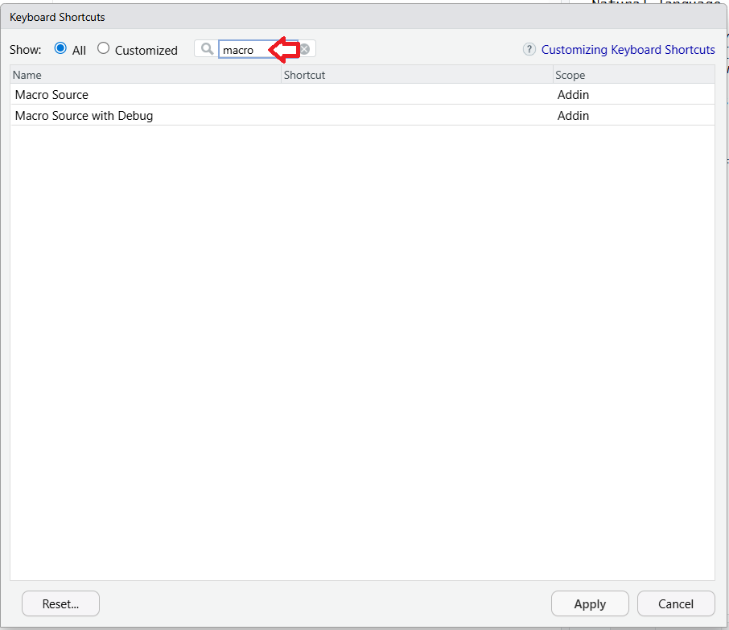
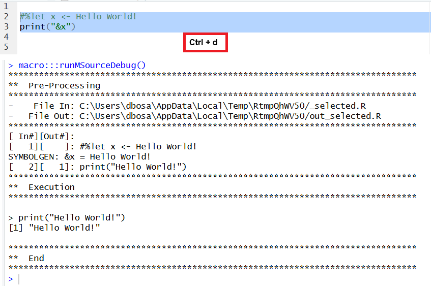

```{r setup, include = FALSE}
knitr::opts_chunk$set(
  collapse = TRUE,
  comment = "#>"
)
```

The **macro** package can be used interactively in RStudio®. First,
it requires a basic package install.  

## Package Install

You can install the **macro** package by executing the following command in the 
R console:

    install.packages("macro")
    
Upon completion of the install, the **macro** package will be available for use
in scripts and programs.  To enhance the user experience, it is recommended
that you set up the package for interactive use in your IDE.  The subsequent 
instructions explain how.


## Addin Menu

The **macro** package contains an Addin menu to facilitate interactive use. 
The addin menu should be available in RStudio upon basic installation.

First, check that you see the **macro** package menu items in your "Addins" 
drop-down:


There are two menus on the Addin:

* **Macro Source**:  Calls the function `runMSource()`.  This function is specially
built for the Addin menu.  It runs the `msource()` function in normal mode, 
but with the "clear" parameter set to FALSE and the "envir" parameter set to
the global environment.  

* **Macro Source with Debug**: Calls the function `runMSourceDebug()`.  This
function runs `msource()` in debug mode.  The "debug" and "symbolgen" parameters
are set to TRUE, and the "clear" and "envir" parameters are set the same as above.

You may use the above menus any time by navigating to the Addin menu with
your mouse. However, the reason the Addin 
menus have been included in the package is so that they can be tied to keyboard 
shortcuts.  The keyboard shortcuts can greatly improve efficiency in 
using the package.  

## Keyboard Shortcuts

Setting up keyboard shortcuts may be somewhat different
depending what operating system you are using.  The instructions and images below are 
for RStudio on Windows.  Please adjust the instructions as appropriate for 
your operating system.

To connect keyboard shortcuts to the **macro** package Addin menu, take the 
following steps:

1. Go to the Tools -> Modify Keyboard Shortcuts menu.

   

2. Type the word "macro" on the search bar.

   

3. On the "Macro Source" row, put your cursor in the "Shortcut" column and 
press the "Ctrl" key and the "m" key. Then on the "Macro Source with Debug" row, 
put your cursor in the "Shortcut" column and press the "Ctrl" key and the "d" key.

   

4. Press the "Apply" button and close the shortcuts dialog.

The **macro** package shortcuts are now enabled in your IDE.

## Test Interactive Usage

To test your shortcuts, open a new R script file, and type the following:

```{r eval=FALSE, echo=TRUE}
#%let x <- Hello World!
print("&x")
```
Then select the above code, and press Ctrl+m.  You should see "Hello World!"
appear in your console:


Next, select the above code again, and press Ctrl+d.  The debug output
should appear in the console:



As a final test, don't select any code and press Ctrl+m again.  The function
should run the entire script, and produce the same results as above.  

Now your environment is set up to use the **macro** package interactively. Enjoy!

