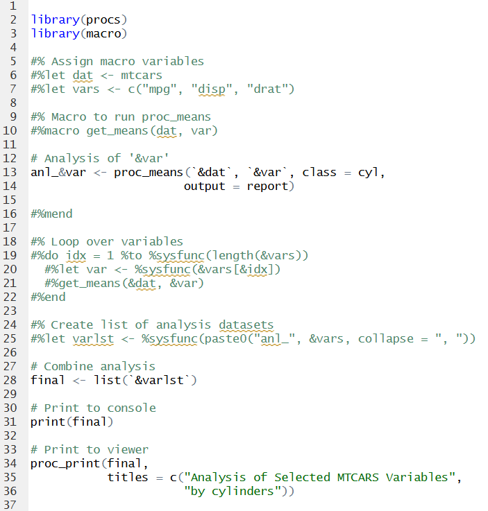

```{r, include = FALSE}
knitr::opts_chunk$set(
  collapse = TRUE,
  comment = "#>"
)
```
The **macro** package provides macro commands and a pre-processor for R programs.
The package can be useful in several ways.  Before illustrating the functionality,
let's first discuss the macro concept at a high level.

# Macro Concept

A macro language is like a meta-language for code.  The meta-language runs first,
generates the regular code, and then the regular code is executed to produce 
some sort of output. It is, at heart, a text manipulation system.

The SAS® macro language is commonly used in SAS programs. The R **macro** package 
was inspired by SAS. Specifically, the **macro** package aims to mimic
SAS macro with "mprint" and "mfile" options turned on.  These options generate 
a resolved code file.

# An R Macro Language

Clearly, a macro language for R will not be the same as the SAS macro language.
The SAS macro language is built into the SAS execution environment.  The SAS
pre-processor is run automatically, and the macro syntax is understood by the 
SAS syntax checker.

With R, none of the above applies.  R does not have a built-in macro language, 
does not have a built-in pre-processor, and the R syntax checker will not 
expect any sort of macro language syntax.

Therefore, to build macro-like functionality in R, we must get a little creative.

# Macro Statements

The first thing to note is that macro statements in the **macro** package are 
written as code comments.  The comments ensure that the R syntax checker will not
generate an error when parsing the macro functions. 

In SAS, macro functions are
prefixed with a percent sign (%).  In R, macro statements are therefore prefixed
with a comment symbol (#) and a percent sign (%).  A simple macro assignment
looks like this:

```{r eval=FALSE, echo=TRUE}
#%let x <- 1
```
A simple macro conditional looks like this:

```{r eval=FALSE, echo=TRUE}
#%if (&x == 1)
  print("x is one!")
#%else
  print("x is something else!")
#%end

```

Note that the above R macro syntax is not identical to the SAS syntax. The syntax
devised for the **macro** package is a blend of SAS and R syntax. 

# Differences Between SAS Macro and R Macro 

Here are some of the major difference between the SAS macro language and the 
R macro language:

  * R macro statements do not end with a semicolon (";").  They are single-line
  commands, and end with a carriage return.
  * R macro commands can be used anywhere in the program.  They are not restricted to 
  use inside macro functions.  
  * Single-quotes will not prevent macro variable resolution.  In the R macro
  language, single and double quotes operate the same.
  * All operators in the R macro language use R syntax, including the 
  comparison operator ("==").
  * R macro variables in open code must be surrounded by backticks ("`") to 
  avoid syntax errors. Inside comments, strings, and other macro commands, they do not 
  need backticks. 
  
Otherwise, the R macro language is similar to SAS in terms of basic functionality.
  
## Available Functionality

The **macro** package supports the most basic functionality of a macro system.
That includes: 

1. **Macro Comments**: Like regular R comments, but are not emitted to the output file.
2. **Macro Variables**:  Allow you to assign a value to a macro variable, and use
the macro variable as a text replacement token.
3. **Macro Conditionals**: If-Then-Else logic that allows you to conditionally 
execute a chunk of code.
4. **Macro Include**: Inserts the contents of an external file into your program.
5. **Built-in Macro Functions**: A small number of macro functions
to make the system more practical.
6. **Macro Do Loops**: Copies code inside the do block for each iteration of the loop.
7. **User-Defined Macro Functions**: The ability to create a user-defined 
text-replacement function, with or without parameters.

The above functionality covers the majority of use cases for a macro language.
Now let's see how the R macro language is actually implemented.


### SAS to R Macro Language Map

The table below maps SAS macro statements to the corresponding statement in 
R.  This table can help SAS programmers quickly understand
how the **macro** package works. 

<style>
.sasstyle {
  color: blue;
  font-family: Courier;
}

.rstyle {
  color: green;
  font-family: Courier;
}
</style>


<table>
<tr><td>&nbsp;</td><td><b>SAS</b></td><td><b>R</b></td></tr>
<tr><td><b>Comment:</b></td>
<td class="sasstyle">%* Here is a comment;</td>
<td class="rstyle">#% Here is a comment</td></tr>

<tr><td><b>Assignment:</b></td>
<td class="sasstyle">%let x = 1;</td>
<td class="rstyle">#%let x <- 1</td></tr>

<tr><td><b>Conditional:</b></td>
<td class="sasstyle">
%if (&x = 1) %then %do;<br>
&nbsp;&nbsp;%put "First condition";<br>
%end;<br>
%else %if (&x = 2) %then %do;<br>
&nbsp;&nbsp;%put "Second condition";<br>
%end;<br>
%else %do;<br>
&nbsp;&nbsp;%put "Default condition";<br>
%end;<br>
</td>
<td class="rstyle">
#%if (&x == 1)<br>
&nbsp;&nbsp;print("First condition")<br>
#%elseif (&x == 2)<br>
&nbsp;&nbsp;print("Second condition")<br>
#%else<br>
&nbsp;&nbsp;print("Default condition")<br>
#%end<br>
</td></tr>


<tr><td><b>Include:</b></td>
<td class="sasstyle">%include "myfile.sas";</td>
<td class="rstyle">#%include "myfile.R"</td></tr>


<tr><td><b>Built in Functions:</b></td>
<td class="sasstyle">
%sysfunc()<br>
%symexist()<br>
%symput()<br>
%nrstr()
</td>
<td class="rstyle">
%sysfunc()<br>
%symexist()<br>
%symput()<br>
%nrstr()
</td></tr>

<tr><td><b>Do Loop:</b></td>
<td class="sasstyle">
%do y = 1 %to 3;<br>
&nbsp;&nbsp;%put Y is &y;<br>
%end;<br>
</td>
<td class="rstyle">
#%do y = 1 %to 3<br>
&nbsp;&nbsp;print("Y is &y")<br>
#%end<br>
</td></tr>

<tr><td><b>User-Defined Function:</b></td>
<td class="sasstyle">
%macro test();<br>
&nbsp;&nbsp;%put "Hello!";<br>
%mend;<br>
<br>
%test();<br>
</td>
<td class="rstyle">
#%macro test()<br>
&nbsp;&nbsp;print("Hello!")<br>
#%mend<br>
<br>
#%test()
</td></tr>


</table>

The table above contains all of the commands in the R macro language. 
For comprehensive documentation, see the 
[Macro Languge Reference](macro-language.html).

# The msource() Function

In the **macro** package, pre-processing of the macro code is accomplished by a special function:
`msource()`. The `msource()` function is similar to the `source()` function in R.
The `msource()` function will execute your code, just like the `source()` function.
First, however, it will execute the **macro** pre-processor.  

The steps can be summarized as follows:

  Step 1: Pre-process the code and resolve all macro language syntax.  
  Step 2: Generate a new code file with the resolved code.  
  Step 3: Execute the resolved code with the `source()` function.  

Notice that the above steps map directly to the way the SAS
macro processor works.

In addition, the R macro language is a text-replacement language, just like SAS.  Macro
variables are swapped out with real values as text replacements.  Macro conditions
are evaluated, and only the code in the TRUE macro conditions is executed. 

All of the above is handled by the `msource()` function. `msource()` is the core
function in the **macro** package.

### Parameters

The `msource()` function has several parameters.  Here is a short summary:

* **pth**: The path to the macro program.
* **file_out**: An optional path to store the generated code.
* **envir**: An optional environment to use for program execution.
* **exec**: A TRUE or FALSE value indicating whether to execute the generated
code.
* **debug**: If TRUE, the function will generate additional debug information.
By default, this information is sent to the console.
* **debug_out**: An optional file path to send the debug information.
* **symbolgen**: If TRUE, macro variable values are added to the debug information.
* **echo**: Echos the generated code to the console. TRUE by default.
* **clear**: Clears the macro symbol table and macro function list at the 
beginning of every call to `msource()`. TRUE by default.

Additional information about the `msource()` parameters is available in the 
function reference.

## How to Use

To use the **macro** package, you will first write your macro-enabled R code in 
a regular ".R" code file.  You can use
RStudio® or another code editor.  The macro statements are written as special
comments, as described above.  You can execute a macro-enabled program in 
three different ways:

* From the console
* From a script
* From a keyboard shortcut  

The below sections will elaborate on these different approaches. 

### Execute From the Console

To execute a macro-enabled program, simply
call the `msource()` function in the console and pass the program path. If 
you want to save the generated code, or run in debug mode, pass the appropriate
parameters to `msource()`.

The `msource()` function provides some convenience for those people working
in RStudio.  If you are working in RStudio, the function will use the path of the currently 
active program by default. In that case, you don't even need to pass the 
program path. Just call `msource()` in the console with no parameters.

A simple example of executing a macro program from the console is provided below.
For a more extensive example, please see [Example 1](macro-example1.html).

### Execute From a Script

The `msource()` function can also be sourced from a regular R program. You can
create a driver script to set up some macro parameters, and then
call the `msource()` function from the driver.

For an example of a driver script, see [Example 2](macro-example2.html) or 
[Example 3](macro-example3.html). 

### Execute From a Keyboard Shortcut

The core features of the **macro** package are also available via 
the RStudio Addin menu and keyboard shortcuts.  These features allow
you to use the **macro** package interactively in RStudio. They make 
writing and debugging macro-enabled programs much easier.

See the [Installation and Setup](macro-setup.html) vignette for
instructions on how to enable and use the **macro** keyboard shortcuts.

## Example Macro Program

Here is what a simple macro-enabled program looks like:



### Console Output

If you execute the `msource()` function in the console, the above program
will run and display the following:

```
> msource()
---------
library(procs)
 library(macro)
 
 # Analysis of 'mpg'
 anl_mpg <- proc_means(mtcars, mpg, class = cyl,
                       output = report)
 
 # Analysis of 'disp'
 anl_disp <- proc_means(mtcars, disp, class = cyl,
                       output = report)
 
 # Analysis of 'drat'
 anl_drat <- proc_means(mtcars, drat, class = cyl,
                       output = report)
 
 # Combine analysis
 final <- list(anl_mpg, anl_disp, anl_drat)
 
 # Print to console
 print(final)
 
 # Print to viewer
 proc_print(final,
            titles = c("Analysis of Selected MTCARS Variables",
                       "by cylinders"))
 
---------
[[1]]
  CLASS VAR  N     MEAN      STD  MIN  MAX
1     4 mpg 11 26.66364 4.509828 21.4 33.9
2     6 mpg  7 19.74286 1.453567 17.8 21.4
3     8 mpg 14 15.10000 2.560048 10.4 19.2

[[2]]
  CLASS  VAR  N     MEAN      STD   MIN   MAX
1     4 disp 11 105.1364 26.87159  71.1 146.7
2     6 disp  7 183.3143 41.56246 145.0 258.0
3     8 disp 14 353.1000 67.77132 275.8 472.0

[[3]]
  CLASS  VAR  N     MEAN       STD  MIN  MAX
1     4 drat 11 4.070909 0.3654711 3.69 4.93
2     6 drat  7 3.585714 0.4760552 2.76 3.92
3     8 drat 14 3.229286 0.3723618 2.76 4.22

```

The `msource()` console output contains two sections.  The first section is the generated
code.  The second section is any printed output from the generated code. In this way,
you can see what code was actually sourced, and the output of that code.

If you do not wish to see the generated code, set the "echo" parameter on
`msource()` to FALSE.

### Viewer Output

The above macro program also displayed the analysis in the RStudio viewer.
It looks like this:


See the [procs](https://procs.r-sassy.org) package documentation for more 
information about the `proc_means()` and `proc_print()` functions. Both
the **macro** package and the **procs** package are part of the 
[sassy](https://r-sassy.org) system of packages.

# Additional Features

## Symbol Table Functions

The functions in the macro package operate via an internal memory register
called the macro symbol table.  The symbol table stores the names and values
for any macro variables, and the definition of any macro functions.  The symbol
table can be accessed from regular R code using a special set of functions.
The symbol table functions are as follows:

* **`symtable()`**: Returns an object containing the macro symbol table and 
macro function list.  By default, this object is printed to the console.
* **`symclear()`**: Clears the macro symbol table and deletes any macro function
definitions.
* **`symget()`**: Gets a macro variable value from the macro symbol table.
* **`symput()`**: Sets the value of a macro variable.

These functions can be used to observe and manipulate the macro symbol table 
from regular R code or from the console. 

### Example Symtable Function

For instance, we can follow up on the `msource()` example from above by calling
the `symtable()` function in the console.  Like this:
```
> symtable()
# Macro Symbol Table: 5 macro variables
     Name                       Value
1    &dat                      mtcars
2    &idx                           3
3    &var                        drat
4 &varlst anl_mpg, anl_disp, anl_drat
5   &vars    c("mpg", "disp", "drat")
# Macro Function List: 1 functions
# Function '%get_means': 2 parameters
- dat
- var
```
The above console output shows the macro symbol table and the macro function
list. This information can be useful for ensuring the program ran correctly
and for debugging.

For a full discussion on the symbol table functions, see the 
[Symbol Table Functions](macro-symtable.html) vignette.

## Debugging

The **macro** package provides extensive debugging capabilities.  These
capabilities can be enabled by activating the "debug" parameter on the 
`msource()` function.  When activated, the debug information will be sent
to the console. 

Let's illustrate the debug feature by running `msource()`
again for the above sample program, but this time set the "debug"
parameter to TRUE:
```
> msource(debug = TRUE)
******************************************************************************** 
**  Pre-Processing 
******************************************************************************** 
-    File In: C:/packages/macro/tests/testthat/programs/sample16.R 
-   File Out: C:\Users\dbosa\AppData\Local\Temp\RtmpQhWV50/sample16.R 
******************************************************************************** 
[ In#][Out#]: 
[   1][   1]:  
[   2][   2]: library(procs) 
[   3][   3]: library(macro) 
[   4][   4]:  
[   5][    ]: #% Assign macro variables 
[   6][    ]: #%let dat <- mtcars 
[   7][    ]: #%let vars <- c("mpg", "disp", "drat") 
[   8][    ]:  
[   9][    ]: #% Macro to run proc_means 
[  10][    ]: #%macro get_means(dat, var) 
[  17][    ]:  
[  18][    ]: #% Loop over variables 
[  19][    ]: #%do idx = 1 %to 3 
[  20][    ]: #%let idx <- 1 
[  21][    ]:   #%let var <- mpg 
[  22][    ]:   #%get_means(&dat, &var) 
[  23][    ]: #%let dat <- mtcars 
[  24][    ]: #%let var <- mpg 
[  25][    ]:  
[  26][   5]: # Analysis of 'mpg' 
[  27][   6]: anl_mpg <- proc_means(mtcars, mpg, class = cyl, 
[  28][   7]:                       output = report) 
[  29][   8]:  
[  30][    ]: #%mend get_means 
[  31][    ]: #%let idx <- 2 
[  32][    ]:   #%let var <- disp 
[  33][    ]:   #%get_means(&dat, &var) 
[  34][    ]: #%let dat <- mtcars 
[  35][    ]: #%let var <- disp 
[  36][    ]:  
[  37][   9]: # Analysis of 'disp' 
[  38][  10]: anl_disp <- proc_means(mtcars, disp, class = cyl, 
[  39][  11]:                       output = report) 
[  40][  12]:  
[  41][    ]: #%mend get_means 
[  42][    ]: #%let idx <- 3 
[  43][    ]:   #%let var <- drat 
[  44][    ]:   #%get_means(&dat, &var) 
[  45][    ]: #%let dat <- mtcars 
[  46][    ]: #%let var <- drat 
[  47][    ]:  
[  48][  13]: # Analysis of 'drat' 
[  49][  14]: anl_drat <- proc_means(mtcars, drat, class = cyl, 
[  50][  15]:                       output = report) 
[  51][  16]:  
[  52][    ]: #%mend get_means 
[  53][    ]: #% end do 
[  54][    ]:  
[  55][    ]: #% Create list of analysis datasets 
[  56][    ]: #%let varlst <- anl_mpg, anl_disp, anl_drat 
[  57][    ]:  
[  58][  17]: # Combine analysis 
[  59][  18]: final <- list(anl_mpg, anl_disp, anl_drat) 
[  60][  19]:  
[  61][  20]: # Print to console 
[  62][  21]: print(final) 
[  63][  22]:  
[  64][  23]: # Print to viewer 
[  65][  24]: proc_print(final, 
[  66][  25]:            titles = c("Analysis of Selected MTCARS Variables", 
[  67][  26]:                       "by cylinders")) 
[  68][  27]:  
******************************************************************************** 
**  Execution 
******************************************************************************** 

> library(procs)

> library(macro)

> # Analysis of 'mpg'
> anl_mpg <- proc_means(mtcars, mpg, class = cyl,
+                       output = report)

> # Analysis of 'disp'
> anl_disp <- proc_means(mtcars, disp, class = cyl,
+                       output = report)

> # Analysis of 'drat'
> anl_drat <- proc_means(mtcars, drat, class = cyl,
+                       output = report)

> # Combine analysis
> final <- list(anl_mpg, anl_disp, anl_drat)

> # Print to console
> print(final)
[[1]]
  CLASS VAR  N     MEAN      STD  MIN  MAX
1     4 mpg 11 26.66364 4.509828 21.4 33.9
2     6 mpg  7 19.74286 1.453567 17.8 21.4
3     8 mpg 14 15.10000 2.560048 10.4 19.2

[[2]]
  CLASS  VAR  N     MEAN      STD   MIN   MAX
1     4 disp 11 105.1364 26.87159  71.1 146.7
2     6 disp  7 183.3143 41.56246 145.0 258.0
3     8 disp 14 353.1000 67.77132 275.8 472.0

[[3]]
  CLASS  VAR  N     MEAN       STD  MIN  MAX
1     4 drat 11 4.070909 0.3654711 3.69 4.93
2     6 drat  7 3.585714 0.4760552 2.76 3.92
3     8 drat 14 3.229286 0.3723618 2.76 4.22


> # Print to viewer
> proc_print(final,
+            titles = c("Analysis of Selected MTCARS Variables",
+                       "by cylinders"))
 
******************************************************************************** 
**  End 
******************************************************************************** 
```
The debug information shows how the incoming macro code was processed. For 
each incoming line, it shows whether that line was emitted to the generated
code file, and how it was resolved.  Any errors during pre-processing
or execution will appear at the point they occurred.  In this way, it
is very easy to find which line has the error.

For a full explanation of the debugging features in the **macro** package,
see the [Debugging](macro-debug.html) vignette.

# Next Steps

Here are some more articles for further exploration:

- [Installation and Setup](macro-setup.html) 
- [Macro Language Reference](macro-language.html) 
- [Symbol Table Functions](macro-symtable.html)
- [Debugging](macro-debug.html)
- [Global Options](macro-globals.html)
- [Example 1: Listing](macro-example1.html)
- [Example 2: Another Listing](macro-example2.html)
- [Example 3: Table](macro-example3.html)
- [Frequently Asked Questions](macro-faq.html)
